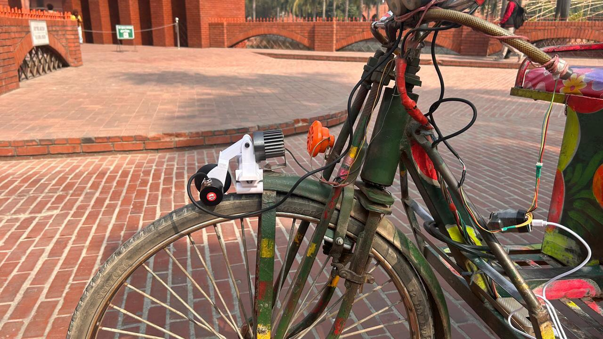
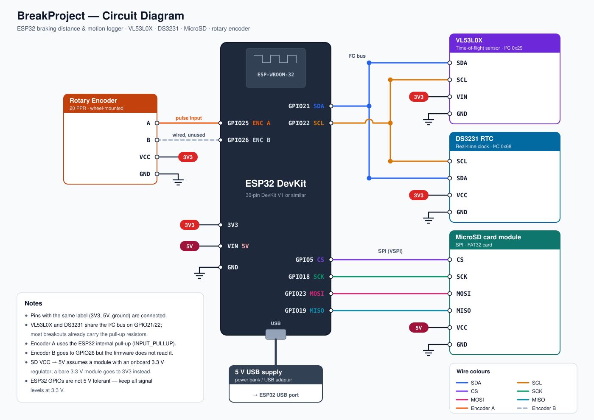
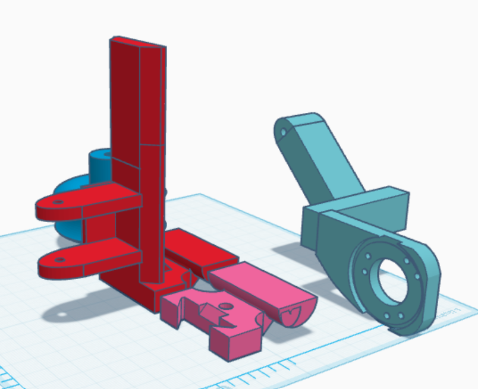
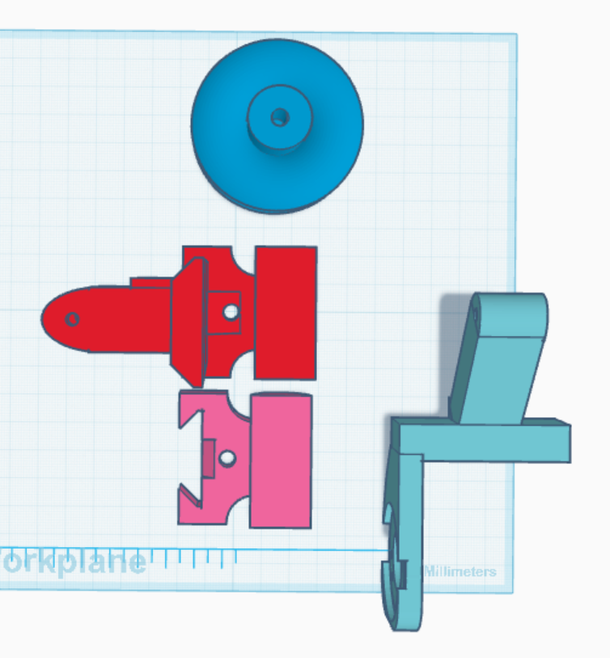
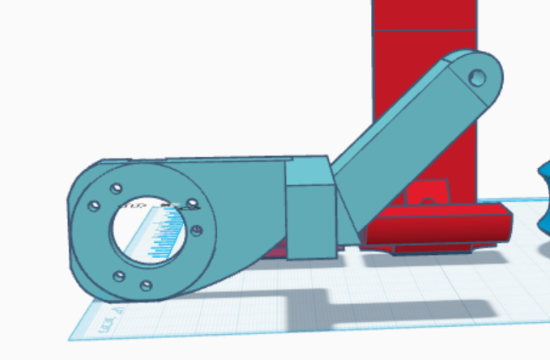
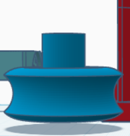
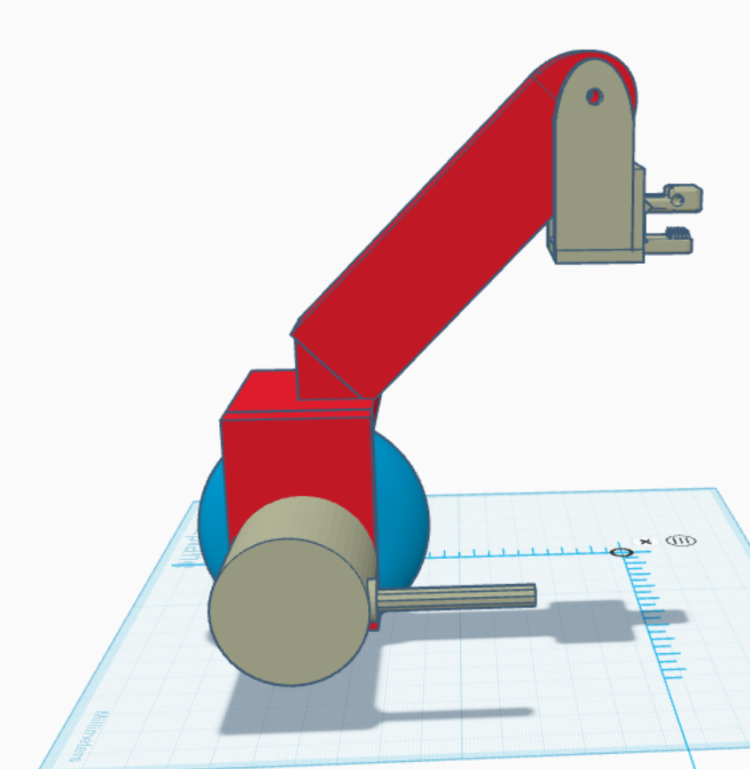
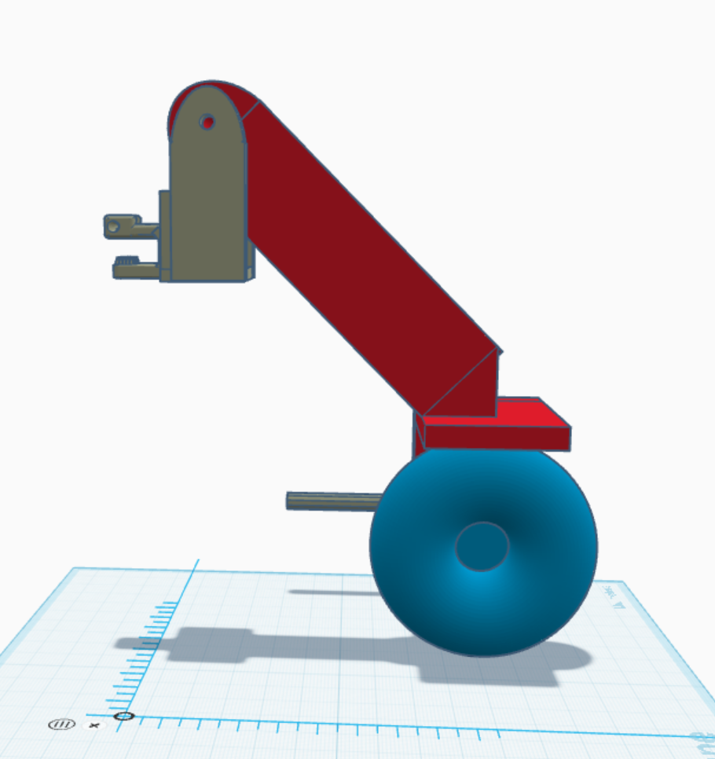
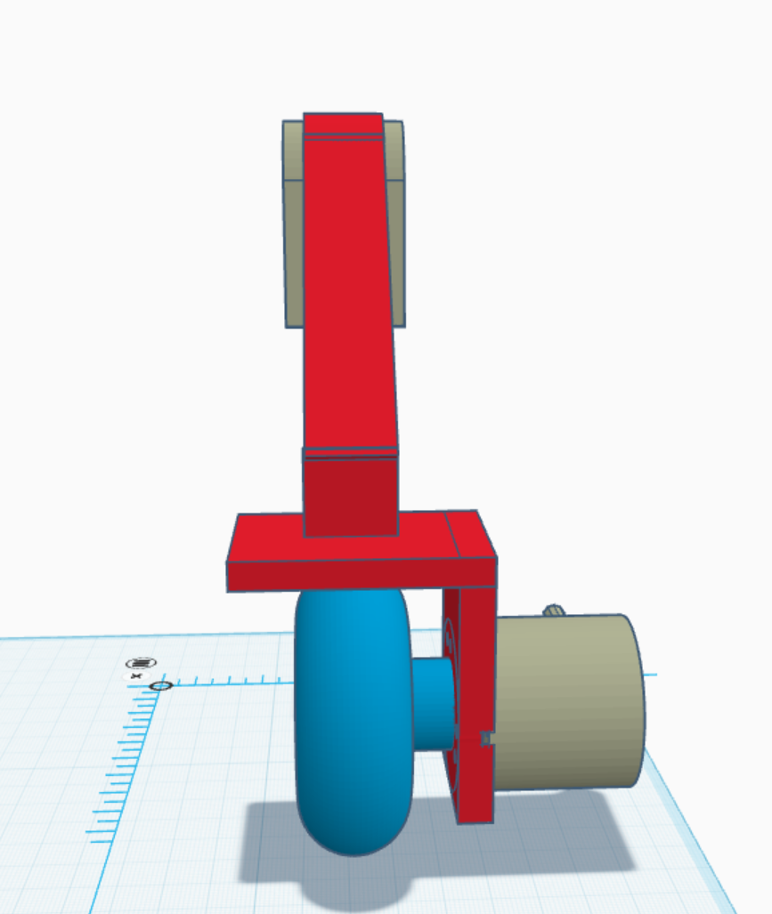
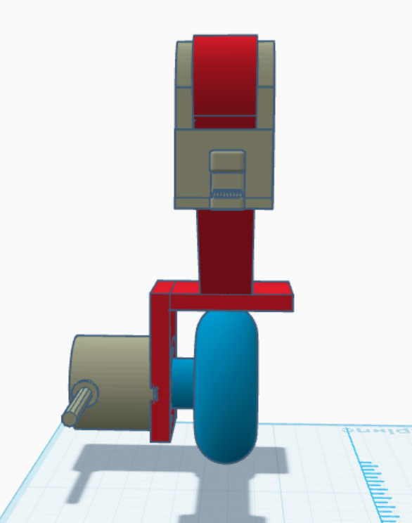

<p align="center">
  
</p>

# BreakProject — ESP32 Braking Distance & Motion Logger

An ESP32 data logger that measures wheel speed, acceleration and travelled
distance from a rotary encoder, detects brake events with a VL53L0X
time-of-flight sensor, and writes timestamped CSV logs to an SD card using a
DS3231 real-time clock.

Built and field-tested on a cycle rickshaw for braking-performance
measurement: each run is stored as its own session folder so successive tests
stay separated.



*Encoder mount on the front wheel of the test cycle rickshaw, with wiring routed
along the frame to the logger.*

## Features

- Wheel **RPM, speed, acceleration and cumulative distance** from a single-channel
  encoder, sampled every 200 ms
- 5-sample moving-average speed filter with exponential decay when pulses stop
- **Brake event detection** via VL53L0X ToF sensor with 5-sample debounce
- Per-event **braking distance, braking time, deceleration** and Soft/Hard
  classification
- Two stop conditions: brake released (ToF) or wheel stationary for 5 s
- **DS3231 RTC** timestamps on every row, so logs survive power cycles
- Automatic session folders (`/S1`, `/S2`, …) on the SD card
- Periodic flush every 5 s plus free-heap reporting over serial

## Hardware

| Component | Interface | ESP32 pin |
|---|---|---|
| Rotary encoder channel A | Interrupt (RISING, pull-up) | GPIO25 |
| Rotary encoder channel B | reserved, not read in this version | GPIO26 |
| VL53L0X ToF sensor | I²C | SDA GPIO21 / SCL GPIO22 |
| DS3231 RTC | I²C | SDA GPIO21 / SCL GPIO22 |
| MicroSD card module | SPI (default VSPI) | CS GPIO5, SCK 18, MISO 19, MOSI 23 |

All modules run from the ESP32's 3V3 rail except the MicroSD module, which takes
5 V on VIN (for modules with an onboard 3.3 V regulator). The ESP32 itself is
powered over USB.

### Circuit diagram



A high-resolution PNG is also available at
[`docs/circuit_diagram.png`](docs/circuit_diagram.png).

Serial monitor runs at **115200 baud**.

## 3D-printed mount

The encoder is driven by a friction roller that rides on the rickshaw's front
tyre. The roller sits on the encoder shaft, the encoder is held by an arm, and
the arm pivots on a clamp fixed to the frame so the roller stays on the tyre.
Designed in Tinkercad; all STL files are in [`3D file/`](3D%20file/).

### v2.0 — current

<table>
  <tr>
    <td></td>
    <td></td>
  </tr>
  <tr>
    <td></td>
    <td align="center"></td>
  </tr>
</table>

| File | Part |
|---|---|
| [`frame-mount.stl`](3D%20file/v2.0/frame-mount.stl) | Frame clamp half with the pivot clevis |
| [`clamp-jaw.stl`](3D%20file/v2.0/clamp-jaw.stl) | Mating clamp half that closes around the frame tube |
| [`swing-arm.stl`](3D%20file/v2.0/swing-arm.stl) | Swing arm with encoder flange and pivot eye |
| [`roller-wheel.stl`](3D%20file/v2.0/roller-wheel.stl) | Grooved friction roller, Ø57 mm, mounts on the encoder shaft |

### v1.0 — original

<table>
  <tr>
    <td></td>
    <td></td>
  </tr>
  <tr>
    <td></td>
    <td></td>
  </tr>
</table>

| File | Part |
|---|---|
| [`frame-clamp.stl`](3D%20file/v1.0/frame-clamp.stl) | Frame clamp with the pivot clevis |
| [`arm-encoder-bracket.stl`](3D%20file/v1.0/arm-encoder-bracket.stl) | Arm with L-bracket that holds the encoder |
| [`roller-wheel.stl`](3D%20file/v1.0/roller-wheel.stl) | Friction roller, Ø65 mm, mounts on the encoder shaft |
| [`encoder-body.stl`](3D%20file/v1.0/encoder-body.stl) | Encoder body model, Ø38 mm |

## Libraries

Install through the Arduino Library Manager:

- `VL53L0X` (Pololu)
- `RTClib` (Adafruit)

`Wire`, `SPI` and `SD` ship with the ESP32 core.

## Configuration

Edit the constants at the top of `Breakprojectwithrtc2/Breakprojectwithrtc2.ino`:

| Constant | Default | Meaning |
|---|---|---|
| `PPR` | 20 | Encoder pulses per wheel revolution |
| `WHEEL_RADIUS` | 0.21 | Wheel radius in metres |
| `TOF_THRESHOLD` | 120 | Brake-engaged threshold in mm |
| `LOOP_DT` | 200 | Motion sampling interval in ms |
| `TOF_DEBOUNCE_COUNT` | 5 | Consecutive below-threshold reads to confirm braking |
| `SOFT_BRAKE_TIME` | 5.0 | Above this duration (s) a stop is logged as `Soft` |
| `FILTER_SIZE` | 5 | Moving-average window for speed |
| `STOP_TIMEOUT` | 5000 | No-pulse time (ms) treated as wheel stopped |

`PPR` and `WHEEL_RADIUS` must match your hardware or every speed and distance
figure will be scaled wrong.

## How brake detection works

The ToF sensor watches a surface that moves into range when the brake is
applied (lever, flag or pad carrier). The sequence is:

1. Reading stays below `TOF_THRESHOLD` for `TOF_DEBOUNCE_COUNT` samples →
   **brake start** is recorded with the current timestamp and speed, and
   distance accumulation for the event begins.
2. The event closes when the reading returns above the threshold
   (`BRAKE STOP (TOF)`) or the wheel has produced no pulses for
   `STOP_TIMEOUT` (`BRAKE STOP (WHEEL)`).
3. One row is appended to `brake.csv` with the elapsed time, braking distance,
   Soft/Hard classification and average deceleration.

A new event cannot start until the ToF reading has gone back above the
threshold, which prevents one long brake application logging repeatedly.

## Output files

Each power-up creates the next free session folder on the SD card — `/S1`,
`/S2`, `/S3`, … — containing two CSV files.

### `motion.csv` — one row every 200 ms

```
Time,RPM,Speed,Accel,Distance,TOF
2026-09-28 14:03:11,142.5,1.565,0.210,12.4418,842
```

| Column | Unit | Meaning |
|---|---|---|
| `Time` | `YYYY-MM-DD HH:MM:SS` | RTC timestamp |
| `RPM` | rev/min | Wheel rotational speed |
| `Speed` | m/s | Filtered linear speed |
| `Accel` | m/s² | Change in speed over the sample interval |
| `Distance` | m | Cumulative distance since power-up |
| `TOF` | mm | Raw time-of-flight reading |

### `brake.csv` — one row per brake event

```
Start,Stop,Time,StartSpeed,BrakeDist,Type,Decel
2026-09-28 14:03:11,2026-09-28 14:03:14,3.21,1.565,2.140,Hard,-0.487
```

| Column | Unit | Meaning |
|---|---|---|
| `Start` | timestamp | When braking was confirmed |
| `Stop` | timestamp | When the event closed |
| `Time` | s | Braking duration |
| `StartSpeed` | m/s | Speed at brake onset |
| `BrakeDist` | m | Distance travelled while braking |
| `Type` | — | `Soft` if duration ≥ `SOFT_BRAKE_TIME`, else `Hard` |
| `Decel` | m/s² | Average deceleration over the event |

## Usage

1. Wire the hardware per the table above and format the SD card as FAT32.
2. Open the sketch in the Arduino IDE, select your ESP32 board, install the two
   libraries and upload.
3. Open the serial monitor at 115200 baud. `SYSTEM READY` means the RTC, ToF
   and SD card all initialised; watch for `TOF INIT FAILED` or `SD FAIL`.
4. Run the test, then power down and read the newest `/Sn` folder off the card.

The ToF baseline distance measured at startup is printed as `TOF base:` — use it
to sanity-check that `TOF_THRESHOLD` sits comfortably below the resting gap.

## Known limitations

- The encoder is read on one channel only, so **direction is not detected** —
  reverse motion adds to the distance total.
- `rtc.lostPower()` only warns on the serial monitor; the RTC is never set from
  the sketch. Set the time once with an RTClib example before the first run.
- If `SD.begin()` fails, `setup()` returns and no logging takes place for that
  power cycle.
- Brake detection infers lever position from a distance reading, so sensor
  alignment and stray reflections directly affect event boundaries.

## License

Released under the [MIT License](LICENSE).

## Author

**Md. Mahin Rahman**\
GitHub: [@thisisdibbo](https://github.com/thisisdibbo)\
Email: [mr.d2003feb@gmail.com](mailto:mr.d2003feb@gmail.com)
